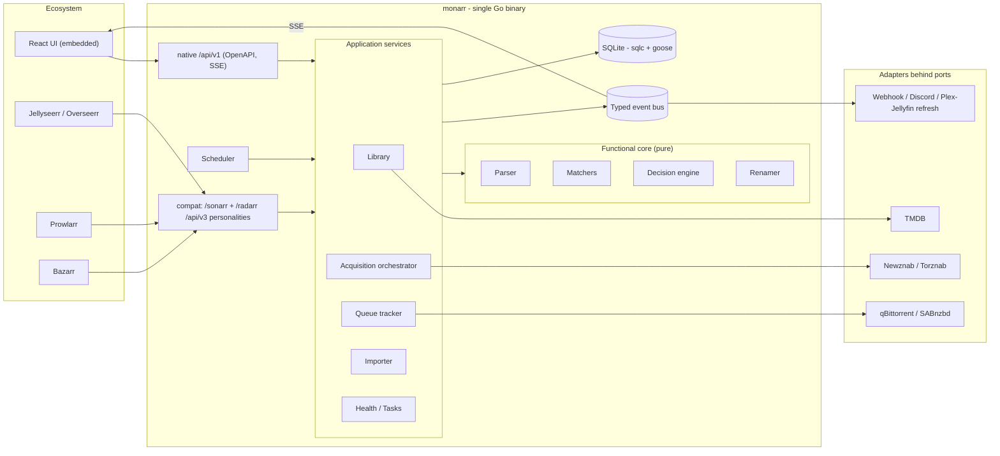

# Monarr — Architecture Blueprint

**A unified, modern rewrite of Sonarr + Radarr in Go.** One binary, one database, one UI, one acquisition pipeline — for TV, movies, and (Phase 2.5) books.

*Name: **Monarr** (committed — no collisions found on GitHub as of July 2026; register the org, Docker Hub namespace, and domain before going public). License: **GPL-3.0**.*

*Status: Draft v0.3 — books promoted from non-goal to roadmap (ADR 0006) · July 2026*

---

## 1. Vision

Sonarr and Radarr are the two pillars of the self-hosted media automation world, and they are, to a first approximation, the same program. Radarr began life as a literal fork of Sonarr, and both remain C#/.NET applications built on the shared "Servarr" lineage: an indexer layer, a release-name parser, a quality decision engine, download client integrations, an import/rename pipeline, notifications, and a React UI. What differs is the shape of the media — episodes hanging off seasons hanging off series, versus standalone movies — plus each app's metadata source and search strategies. Everything else is duplicated effort, duplicated configuration, duplicated bugs, and two daemons where one would do.

This project rebuilds that shared machinery **once**, in Go, as a modular monolith with hexagonal (ports-and-adapters) architecture, and models the TV/movie difference where it actually lives: in the domain model, not in the application boundary.

**Goals**

- One self-contained static binary (UI embedded) managing both movies and TV, deployable on a NAS, a Pi, or in a minimal container.
- A clean, unified domain model in which ~85% of the code has no idea whether it is handling a movie or an episode.
- First-class compatibility with the existing ecosystem: a Sonarr/Radarr **v3 API shim** so Jellyseerr/Overseerr, Prowlarr, and Bazarr work against it from day one.
- Modern engineering throughout: a pure functional core (parser, decision engine, renamer) under heavy test, typed events, spec-first API, structured logging, boring reliable storage (SQLite).

**Non-goals (initially)**

- Music, comics (Lidarr territory) — but the domain model deliberately leaves the door open. *(Books were listed here in v0.2; they were promoted to the roadmap in v0.3 after Readarr's retirement left the niche unserved — see §10 Phase 2.5 and ADR 0006.)*
- Native indexer/tracker definitions — we speak Newznab/Torznab and let Prowlarr or Jackett own the several-hundred-tracker zoo.
- Anime absolute-numbering perfection, custom-format parity, and the long tail of 15 download clients — these are roadmap phases, not MVP.
- Distributed anything. This is a homelab app; a modular monolith is the modern choice, not a compromise.

## 2. Landscape and prior art (as of July 2026)

Before designing, it's worth confirming this niche is actually open. It is.

- **Sonarr** is on v4.0.17 (March 2026), still .NET, with a `v5-develop` branch in progress — evolution, not unification. **Radarr** is on v6.1.1 (March 2026). They remain two separate applications with no announced plan to merge.
- **bobarr** was the notable earlier "all-in-one Sonarr/Radarr/Jackett alternative" (TypeScript, GraphQL + Next.js, multi-container). It validated the demand but never left beta and has been dormant for years.
- **Prismarr** (2026, PHP/Symfony) unifies the *experience* — one dashboard, one calendar, one search across Radarr + Sonarr + Prowlarr + Jellyseerr — but it sits *on top of* the existing apps rather than replacing them. Same story for the various multi-instance dashboards (e.g. arr-dashboard). Their existence is evidence that users want unification; none of them removes the underlying duplication.
- Adjacent modern rewrites exist at other layers (e.g. Rust usenet downloaders, Go tools like autobrr) but nothing actively maintained replaces the Sonarr+Radarr pair itself with a single modern app.
- **Readarr (books) was retired by the Servarr team** and as of mid-2026 has no maintained *arr-class successor — users cobble together LazyLibrarian, shelfmark, and metadata shims. Its post-mortem lesson: the pipeline was fine; the bespoke metadata-scraping backend killed it. This vacancy is why books moved onto Monarr's roadmap (v0.3, ADR 0006).

**Licensing.** Sonarr and Radarr are both GPL-3.0. **Decision (v0.2): Monarr is GPL-3.0 as well.** That keeps every option open — reading upstream source while designing, porting their release-parser test corpora as golden tests (hugely valuable, see §8), and lifting scoring rules for custom formats later. A permissive license (MIT/Apache) would force a strict clean-room approach and make parser fidelity much slower to achieve. GPL costs a hobby project essentially nothing.

## 3. What's actually shared vs. media-specific

The entire design hinges on getting this split right. Analysis of both codebases' feature surface:

| Subsystem | Today (Sonarr + Radarr) | Unified design |
|---|---|---|
| Indexer search/RSS (Newznab/Torznab) | Duplicated per app | **One implementation** |
| Release-name parser | Two diverged forks of the same parser | **One implementation**, media-kind aware |
| Quality model, profiles, upgrade logic | Duplicated, drifted | **One implementation** |
| Decision engine ("grab this or not") | Duplicated | **One implementation** |
| Download clients (qBit, SAB, …) | Duplicated per app | **One implementation** |
| Queue tracking / completed-download handling | Duplicated | **One implementation** |
| Import, hardlink/copy, rename engine | Duplicated, different tokens | **One implementation**, per-kind naming templates |
| History, blocklist, tags, root folders | Duplicated | **One implementation** |
| Notifications / connections | Duplicated | **One implementation** |
| Calendar, wanted/missing, health checks | Duplicated | **One implementation** |
| Web UI shell, settings, activity | Two React apps | **One React app** |
| Media hierarchy | Series→Season→Episode vs Movie | **Kind-specific domain code** |
| Metadata provider | TVDB (via Skyhook) vs TMDB | **One provider (TMDB serves both)**, port allows others |
| Search query construction | Per-kind strategies | **Kind-specific strategy behind one interface** |
| Release↔media matching | Episode/season logic vs movie/year logic | **Kind-specific matcher behind one interface** |

The media-specific column is small and sharply bounded. That is the whole argument for one app — and the design below quarantines that column behind two interfaces (`SearchPlanner`, `ReleaseMatcher`) so nothing else in the system ever branches on media kind.

## 4. The unified domain model

### 4.1 The key abstraction: the Wantable

Sonarr hunts episodes (and season packs); Radarr hunts movies. The unification move is to make the acquisition pipeline operate on an abstract **Wantable** — "a thing the system wants on disk at a given quality" — and never on movies or episodes directly.

```go
// domain/wantable.go — the contract the entire pipeline is built against.
type Wantable interface {
    ID() WantableID          // stable identity: movie:42, episode:7:S02E05, season:7:S02
    MediaItemID() MediaItemID
    Profile() ProfileID      // quality profile that governs decisions
    Monitored() bool
    CurrentFiles() []MediaFileID // what's on disk now (drives upgrade decisions)
}

// The ONLY two places media-kind knowledge is allowed to live:
type SearchPlanner interface {
    // Queries to send to indexers for this wantable
    // (movie: "Title 2024"; episode: "Title S02E05"; season: "Title S02"; +ID-based caps queries)
    Plan(w Wantable) []SearchQuery
}
type ReleaseMatcher interface {
    // Does this parsed release satisfy this wantable, and which wantables does it cover?
    // (a season pack matches MANY episode wantables; a multi-episode file matches several)
    Match(r ParsedRelease, candidates []Wantable) []Match
}
```

A movie is one Wantable. An episode is one Wantable. A season is *also* a Wantable (the season-pack search target) that, when grabbed, satisfies many episode Wantables at import time. This asymmetry — one download covering many wanted units — is Sonarr's hardest structural feature, and modeling it from day one is what keeps the design honest. It also happens to generalize cleanly later (an album covering many tracks is the same shape). A **book** (v0.3, ADR 0006) is the degenerate case from the other direction: one standalone Wantable, typically one file — which is exactly why books make a cheap third kind and a good proof that the pipeline never branches on media kind.

### 4.2 Entities

```text
MediaItem (aggregate root — one library entry)
├─ kind: movie | series | book   ├─ monitored, tags[]
├─ title, sortTitle, year        ├─ qualityProfileID
├─ ids: {tmdb, imdb, tvdb?,      ├─ rootFolderID, path
│        isbn?, olid?, asin?}
├─ metadata cache (overview, images, genres, status, runtime)
├─ movie-only: collection, minimumAvailability (announced|inCinemas|released)
├─ book-only: authors[], bookSeries? (name + position) — see ADR 0006
└─ series-only: seriesType (standard|daily|anime), ended
   └─ Season (number, monitored)
      └─ Episode (seasonNum, epNum, absoluteNum?, airDateUTC, title, monitored)

MediaFile: path, size, quality, mediaInfo, provenance, confidence, probedAt,
           sourceRelease, sourceIndexer
  · movie file  → links to 1 movie
  · episode file → links to 1..n episodes   (multi-episode files are real; n:m link table)
  · mediaInfo is MEASURED (ADR 0013): container/codec/dimensions/bit depth/
    HDR/interlacing/audio/duration, read from the file's own headers by
    domain/mediainfo — no ffprobe, no image change. provenance says where
    `quality` came from (probe · filename · release · manual · failed ·
    implausible) and confidence qualifies an inferred source. Resolution is
    measured fact; source is inference, and a low-confidence inference never
    evicts a file.
  · `implausible` is the one provenance that changes what monarr DOES. The
    others range over how much we know; this one says the measurement refutes
    itself — a 2160p file at 725 kbps, or a declared TrueHD track the whole
    file has no room for (domain/mediainfo/plausible.go). Such a file stays on
    disk and stays visible, and stops counting toward the item being
    satisfied, so the search for a real copy continues. `failed` means we do
    not know, which is a reason to LEAVE A FILE ALONE; `implausible` means we
    do know, which is the opposite.
  · sourceRelease/sourceIndexer name what monarr grabbed to produce the file,
    empty for an adopted one. They exist so "this file is bad, never take that
    release again" has something to point at after the download row is gone.

QualityProfile: target, floor?, upgradesAllowed  (ADR 0014)
  · target caps grabs by resolution and defines "done"; floor says what is
    not worth grabbing at all. The compat shim synthesizes the Radarr-shaped
    allowed-list + cutoff from the target, so *arr consumers see no change.
  (custom-format scoring slots in here later as an additive score, exactly like upstream)

Release (transient, never persisted except in history):
  title, indexer, protocol (torrent|usenet), size, seeders/grabs, publishDate, downloadURL
  + ParsedRelease: {title tokens, year, season/eps, quality, source, resolution,
                    codec, group, language, edition, proper/repack}

Download (queue item, persisted): release snapshot, clientID, clientHandle,
  targetWantables[], state: grabbed→downloading→completed→importing→imported | failed
HistoryEvent (append-only): grabbed | imported | upgraded | renamed | deleted | failed
Blocklist entry: release signature + reason + wantable scope
```

Notable choices, stated as decisions:

- **One `media_items` table, not two.** A `kind` column plus nullable kind-specific columns (they are few) beats parallel `movies`/`series` tables everywhere downstream: one tag system, one root-folder system, one history FK, one search index, one UI list endpoint. Episodes/seasons live in child tables that are simply empty for movies.
- **Files link to episodes many-to-many.** A season pack import produces files spanning episodes; a double-episode file (`S01E01E02`) links to two episodes. Radarr's 1:1 movie↔file is just the degenerate case. Getting this wrong is unfixable later without painful migrations.
- **History is append-only events.** Upstream got this right; it powers the activity UI, failure handling ("this release already failed, skip it"), and debuggability for free.
- **TMDB as the single metadata provider for both video kinds.** TMDB has full TV series/season/episode data, which collapses Sonarr's TVDB dependency and Radarr's TMDB dependency into one adapter, one API key, one rate-limit policy. The `MetadataProvider` port keeps TVDB/AniDB addable later (anime numbering will eventually want them — see §11). TVDB↔TMDB episode-ordering differences are a known wrinkle called out in the risk register.
- **Books get their own metadata adapter behind the same port** (Phase 2.5, ADR 0006): bake-off between Open Library, Google Books, and Hardcover at implementation time. Hard constraint from Readarr's post-mortem: no bespoke scraping middleman we have to operate — a public API spoken directly, cached aggressively. Ebook vs audiobook is **not** a new kind: both are quality groups in ordinary QualityProfiles ("Ebook", "Audiobook", or "Either" is just a profile choice).

### 4.3 The functional core

Four components are **pure functions** — no I/O, no clock, no globals — because they are where all the real complexity and all the real bugs live, and pure code is the only kind you can test at the density required:

1. **Parser** — `ParseReleaseTitle(string) → ParsedRelease`. Table-driven, exhaustively golden-tested (§8). The single highest-risk component in the whole system.
2. **Matcher** — `Match(ParsedRelease, []Wantable) → []Match` per media kind (title normalization, year tolerance, season/episode & season-pack coverage, later: absolute numbering).
3. **Decision engine** — `Decide(release, profile, currentFiles, blocklist, queueState) → Accept | Reject{reasons} | UpgradeFor{files}`. Every rejection carries a machine-readable reason code surfaced in the UI ("rejected: below cutoff", "rejected: already grabbed and failed") — upstream's interactive-search rejection notes are one of its best features; we keep them structural.
4. **Renamer** — `Render(namingTemplate, mediaItem, fileAttrs) → relative path`. Token-compatible with Sonarr/Radarr's naming schemes ({Series Title}, {Movie CleanTitle}, {Quality Full}, …) so existing libraries don't need renaming and muscle memory transfers.

Everything around these — indexer HTTP calls, download client polling, filesystem moves, DB writes — is the imperative shell, kept thin and dumb.

## 5. System architecture

A **modular monolith** with hexagonal boundaries: one process, one SQLite file, strict internal module boundaries enforced by Go package visibility (`internal/`), all side-effecting integrations behind ports.



**Ports** (Go interfaces, one file each, adapters in sibling packages):

- `Indexer` — `Search(ctx, SearchQuery) ([]Release, error)` and `FetchRSS(ctx) ([]Release, error)`. MVP adapter: **Newznab/Torznab** (one adapter — the protocols are near-identical XML APIs). This single adapter reaches every indexer Prowlarr or Jackett can proxy, which is why native tracker definitions are a non-goal.
- `DownloadClient` — `Add(ctx, Release) (Handle, error)`, `Statuses(ctx, []Handle)`, `Remove(ctx, Handle, deleteData bool)`. MVP: **qBittorrent** (WebUI API) and **SABnzbd** — one per protocol, covering the most common homelab pair.
- `MetadataProvider` — search + hydrate movie/series/episodes. MVP: **TMDB**.
- `Notifier` — `OnEvent(ctx, Event) error` subscribed to the bus. MVP: **webhook** + **Discord**; Plex/Jellyfin library-refresh is just another Notifier, exactly like upstream's "Connections".
- `ImportListProvider` — deferred (Trakt/TMDB lists), but the port is defined early because it's cheap to do so.

**Infrastructure choices** inside the monolith:

- **Event bus**: in-process, typed pub/sub (small hand-rolled fan-out over channels). The bus feeds notifiers, the SSE stream to the UI, and the history writer. No external broker — an event bus is a pattern, not a deployment.

  The events that exist, with the wire names the SSE stream and the notifiers key off. This list is exhaustive on purpose: it previously named `DownloadCompleted`, `FileImported` and `UpgradeCompleted`, none of which were ever built, and a doc that describes events you could subscribe to but cannot is worse than one that says nothing.

  | Event | Wire name | Published when |
  |---|---|---|
  | `MediaAdded` | `media.added` | An item is added to the library |
  | `ReleaseGrabbed` | `release.grabbed` | A grab is accepted by a download client |
  | `ImportCompleted` | `import.completed` | Files have landed in the library. Carries the paths, the unique parent dirs, the item's TMDB/IMDb ids, its kind, and the transfer id — everything a media server needs to index exactly what appeared (plan §5.4) |
  | `ImportFailed` | `import.failed` | A completed download could not be imported |
  | `FileProbed` | `library.file.probed` | ffprobe has measured a file |
  | `ScanCompleted` | `library.scan.completed` | A library scan finished |
  | `health.Changed` | `health.changed` | The overall health status transitioned |
  | `JobFinished` | `job.finished` | A background job finished |
  | `TaskCompleted` | `task.completed` | A scheduled task finished |

  There is deliberately **no** `DownloadCompleted`. "The client finished downloading" and "the files are in the library" are different moments with different consequences, and only the second is worth acting on: reacting to the first tells a media server to index a folder that is still being unpacked (nzbd plan §N1 is the same distinction on the other side of the wire).
- **Scheduler**: in-process cron-style ticker driving named tasks (RSS sync every N min, queue refresh, library refresh, backup) with per-task state (last run, next run, lock) persisted so the UI can show and trigger them — upstream's "Tasks" page is good UX worth keeping. Backoff and jitter built in.
- **Single-writer discipline for SQLite**: all writes flow through one connection (goroutine-owned), readers use a read pool with WAL mode. This sidesteps SQLite's write-lock contention entirely at homelab scale (a few writes/sec at peak).

### 5.1 Key runtime flows

**RSS sync (the automation heartbeat)** — every ~15 min per indexer: fetch RSS → parse every title (pure) → match against the *wanted index* (monitored Wantables missing files or below cutoff, kept as an in-memory index rebuilt on library events) → decision engine → grab winners → record history + emit events. Everything between "fetch" and "grab" is pure and unit-testable as one composed function.

**Interactive search** — user (or seerr request) targets a Wantable → SearchPlanner builds queries → fan out to enabled indexers concurrently with per-indexer timeouts → parse/match/decide → return ranked candidates *with rejection reasons attached* → user picks or auto-grab takes the top.

**Explicit Wanted search** — the API accepts an all/reason/group/target scope
and snapshots its exact target ids from fresh authoritative Wanted state. A
durable run owns one normal-priority queue job at a time; each job revalidates
and searches exactly one target, checkpoints its result and cursor, then a
coordinator enqueues the continuation after the predecessor retires. The same
coordinator repairs enqueue gaps after restart, honors persisted cancellation,
and interrupts a run whose chunk exhausts queue retries. Pacing lives in each
continuation's `run_after`, so a delay never occupies a worker. Automatic
paths share an in-process `(mediaItemId, copyId)` reservation, which serializes
season and episode work for one copy without blocking another copy. This is a
single-process overlap guarantee; a multi-process deployment still needs a
store-backed acquisition reservation.

**Grab → import** — grab sends to the right client by protocol → queue tracker polls clients (with jittered interval) reconciling client state to `Download` state machine → on completed: importer scans the payload directory, parses file names, maps files→Wantables via the matcher (season packs fan out here), runs per-file decisions (upgrade? quality mismatch? sample?) → hardlink-or-copy into library layout via Renamer → link `MediaFile` rows, fire `FileImported`/`UpgradeCompleted` (old file cleanup per profile), notify. Failures at any stage mark the Download failed, blocklist the release signature, and (if configured) trigger an automatic re-search — upstream's failed-download handling loop, kept.

**Library reconcile** — on demand or scheduled: walk root folders, parse on-disk files, diff against DB (files added/removed/changed externally), repair links. The system must tolerate humans touching the filesystem; treating disk as a source of truth to reconcile against (rather than assuming exclusive ownership) is what makes *arr apps feel robust.

## 6. Sonarr/Radarr v3 API compatibility shim

The ecosystem multiplier. Jellyseerr, Prowlarr, and Bazarr each speak to Sonarr and Radarr as *separate servers*, so monarr exposes **two compat personalities on one port, distinguished by URL base**:

```
http://host:PORT/sonarr/api/v3/...   ← configure in tools as Sonarr, URL base /sonarr
http://host:PORT/radarr/api/v3/...   ← configure in tools as Radarr, URL base /radarr
```

Every mainstream ecosystem tool supports a URL base for *arr servers (it's a first-class *arr concept), so this needs no port gymnastics. Each personality reports a plausible `version` in `/system/status` (current Sonarr/Radarr version strings) so client-side version gates pass, honors `X-Api-Key`, and matches routes case-insensitively (clients vary between `/qualityProfile` and `/qualityprofile`).

Scope the shim to **what the tools actually call**, not the full v3 surface:

| Consumer | Needs (v3 endpoints) | Purpose |
|---|---|---|
| Jellyseerr/Overseerr | `/system/status`, `/qualityprofile`, `/rootfolder`, `/tag`, `/movie` + `/movie/lookup`, `/series` + `/series/lookup`, `/queue`, `/command` (search) | Validate connection, populate its dropdowns, add requested media, show availability |
| Prowlarr | `/system/status`, `/indexer` + `/indexer/schema`, `/indexer/test` | Push Torznab/Newznab indexer configs into us ("Apps" sync) |
| Bazarr | `/system/status`, `/series`, `/episode`, `/episodefile`, `/movie`, `/moviefile`, `/history` | Enumerate library + files to fetch subtitles for |
| Generic | webhook Connections outbound; `/calendar`, `/health` | Dashboards (Homarr etc.), notifications |

The shim is a **translation layer only** — compat handlers map v3 DTOs onto native services, own no logic, and live in one quarantined package (`internal/compat/{sonarr,radarr}`) generated where possible from the official published OpenAPI specs. Divergence risk is handled by conformance testing with the real tools (§8). The native `/api/v1` stays clean and is the only API the UI uses.

## 7. Technology stack

| Concern | Choice | Rationale |
|---|---|---|
| Language | Go (recent stable toolchain) | Single static binary, trivial cross-compile (NAS/Pi/x86), goroutines fit the poll-and-fan-out workload, boring and maintainable solo |
| HTTP | stdlib `net/http` mux (+ small middleware) | Go ≥1.22 pattern routing makes frameworks unnecessary; fewer deps = less churn |
| API definition | OpenAPI 3, spec-first via oapi-codegen | Typed handlers/DTOs for `/api/v1`; the spec doubles as UI client codegen input |
| Storage | SQLite, WAL mode, via `modernc.org/sqlite` (pure Go) | No CGO keeps cross-compile trivial; homelab write volumes are tiny; online-backup task is nearly free |
| Data access | `sqlc` + `goose` migrations (embedded via `go:embed`) | Compile-time-checked SQL beats an ORM for a schema this relational; migrations ship inside the binary |
| Jobs | in-process scheduler (cron-style) | No external queue; persisted task state for UI |
| Events | hand-rolled typed pub/sub | ~100 lines; brokers are for distributed systems |
| Logging | `log/slog` | Structured, stdlib, zero deps |
| Config | env + optional file for server config (port, data dir, auth, log level); everything else lives in the DB and is managed in the UI | Matches *arr operational model; 12-factor for the ops layer, database for user intent |
| Frontend | React + TypeScript + Vite; TanStack Query/Router; served via `go:embed` | User preference; largest ecosystem; one deployable |
| Live updates | SSE from the event bus | Simpler than websockets, proxies love it; queue/activity update live |
| Auth | API key (native + compat) + session login for UI | Matches ecosystem expectations (X-Api-Key); reverse-proxy/forward-auth friendly |
| Packaging | goreleaser: binaries + minimal container image on ghcr.io | `docker run -v /data -v /media -p PORT` and done; GHCR is free for public images |
| Observability | health-check registry (surfaced in UI like upstream), optional Prometheus `/metrics` | Homelab-appropriate |

## 8. Testing strategy

Test effort is deliberately lopsided toward the functional core, because that's where a decade of upstream edge cases lives.

**The golden parser corpus is the single most important asset in the project.** Sonarr and Radarr's parser test suites encode thousands of real-world release-name edge cases (scene naming, anime groups, PROPER/REPACK, weird years, 8-bit vs hi10p, `S01E01E02`, daily-show dates, editions, …). Being GPL-compatible (§2), we port those test cases wholesale into a golden corpus (`testdata/releases/*.json`) and treat upstream's expected outputs as the spec. Add fuzzing on top (the parser must never panic on arbitrary bytes). This converts the scariest rewrite risk into a measurable conformance number ("parser passes 97.4% of upstream corpus") instead of a vibe.

Decision engine and matcher get table-driven tests including the nasty cases: season pack vs. individual episodes already on disk, upgrade-vs-sidegrade at cutoff, proper handling, multi-episode file overlap, blocklisted re-appearance. Renamer round-trips against upstream token documentation. Adapters get contract tests against real services in containers (qBittorrent, SABnzbd) run in CI on a schedule rather than per-commit.

**Compat conformance is tested with the actual consumers**: a docker-compose harness that boots monarr + real Jellyseerr + real Prowlarr + real Bazarr and scripts their happy paths against the shim (connect, sync, request a movie, request a season). If Jellyseerr can complete a request cycle, the shim works; no amount of unit testing substitutes for this.

## 9. Migration from existing Sonarr/Radarr

Adoption (including yours) depends on not starting from zero. Two mechanisms — **filesystem adoption is the committed path (v0.2 decision); DB import is a later stretch item**:

1. **Filesystem adoption (primary).** Point Monarr at existing root folders and let library reconcile + TMDB matching build the library. Because the Renamer is token-compatible, existing file layouts adopt as-is with zero renames. The accepted cost: per-episode monitoring nuance, history, and blocklist don't carry over.
2. **Library import from the *arr databases (Phase 4 stretch, demand-driven).** Sonarr and Radarr keep everything in well-understood SQLite files, so a one-shot importer for media items + monitoring state, tags, quality-profile *mappings* (best effort), file records, and optionally history remains on the roadmap for adopters who want continuity — it is just off the critical path.

The TVDB→TMDB switch for TV is the one lossy edge: episode ordering occasionally differs between providers, so reconcile flags series whose on-disk episode structure disagrees with TMDB for manual review rather than silently mis-mapping (risk register, item 6).

## 10. Phased roadmap

Each phase ends in something you actually run at home; value arrives at Phase 2, ecosystem leverage at Phase 4.

**Phase 0 — Walking skeleton** *(the scaffold I'll generate next)*. Repo + CI, single binary serving the embedded React shell, `/api/v1/system/status`, SQLite + migrations + sqlc wired, config, slog, event bus, scheduler skeleton, health page. Success: `docker run` → UI loads, status reports, tests pass.

**Phase 1 — Library.** TMDB adapter, add/search movie & series (with seasons/episodes hydration), library browse UI, root folders, disk scan + reconcile, manual file mapping. Success: your real media folders imported and browsable.

**Phase 2 — Acquisition core (first real value).** Parser v1 + golden corpus harness, matcher, decision engine v1, quality profiles, Torznab/Newznab adapter, interactive search UI with rejection reasons, qBittorrent + SABnzbd adapters, queue tracking, importer + renamer. Success: search → grab → auto-import → correctly named file → visible in Plex/Jellyfin, for both a movie and a season pack.

**Phase 2.5 — Books (v0.3 addition, ADR 0006).** The `book` kind end-to-end, ebooks **and** audiobooks: metadata adapter (Open Library / Google Books / Hardcover bake-off) behind the existing port, book-mode parser rules + Readarr's GPL corpus ported into testdata, book `SearchPlanner`/`ReleaseMatcher` (author+title queries; Torznab 7000-series + 3030 categories), format-based quality ladder (EPUB/AZW3/MOBI/PDF/M4B/MP3), `{Author Name}/{Book Title}` naming with a Calibre-friendly layout. Conservative defaults at launch: interactive-search-first before trusting auto-grab for books. Success: request an ebook and an audiobook → correctly named files appear in the library. Doubles as the proof that the acquisition pipeline is genuinely kind-agnostic.

**Phase 3 — Automation.** Wanted index + RSS sync loop, backlog search, failed-download handling + blocklist + auto-retry, calendar, webhook/Discord notifiers, Plex/Jellyfin refresh, backups. Success: monarr runs unattended for a month and new episodes/movies just appear.

**Phase 4 — Ecosystem.** v3 compat personalities scoped per §6, conformance harness green against real Jellyseerr/Prowlarr/Bazarr; *arr DB migration importer as a stretch item (filesystem adoption is the committed path). Success: your existing stack swaps Sonarr+Radarr for Monarr without the neighbors noticing.

**Phase 5 — Depth & parity tail.** Custom-format scoring engine, more download clients (Transmission, Deluge, NZBGet…), import lists (Trakt/TMDB), anime numbering via TVDB/AniDB mapping tables (parked low — the target library is anime-light), multi-user/auth hardening, richer UI (interactive season views, mass editor). Postgres is explicitly off the roadmap (v0.2 decision): SQLite-only unless a concrete need emerges.

Honest sizing: solo at nights-and-weekends pace, Phase 2 is roughly the 3–6 month mark and full parity tail is 12–24 months. The compat shim is what makes the project useful long before parity.

## 11. Risk register (the icebergs)

1. **Parser fidelity** — the defining risk. Mitigation: golden corpus port + fuzzing + conformance percentage tracked in CI (§8); parser kept pure so fixes are cheap.
2. **Season packs & multi-episode files** — the structurally hard part of unification. Mitigation: n:m file↔episode schema and Wantable fan-out designed in from day one (§4); dedicated test tables.
3. **Download-client quirk zoo** — every client API lies a little. Mitigation: two clients until Phase 5; containerized contract tests; state machine tolerant of client restarts/duplicates.
4. **Compat drift** — v3 is big and undocumented corners exist. Mitigation: scope to consumer-verified endpoints (§6), conformance-test with real tools, treat the shim as forever-beta and log unknown requests to guide expansion.
5. **Scope creep toward parity** — custom formats alone is a mini-language. Mitigation: phased roadmap with "runs unattended" (P3) before "ecosystem" (P4) before "parity" (P5); non-goals list.
6. **Metadata-source mismatch** — TMDB vs TVDB episode ordering; daily shows and anime are the worst offenders. Mitigation: importer flags disagreements; provider port keeps TVDB addable; anime explicitly deferred.
7. **Solo-maintainer sustainability** — the real killer of rewrites. Mitigation: boring tech, stdlib bias, pure core with dense tests, modular monolith (no infra to babysit), and the compat shim making it personally useful early.
8. **Book metadata source quality** (v0.3) — the thing that actually killed Readarr. No book provider matches TMDB's completeness; coverage/dedup across editions is messy everywhere. Mitigation: provider bake-off behind the port, aggressive caching, no operated scraping middleman, and manual-match UI as the escape hatch.
9. **Book release naming & matching** (v0.3) — book releases are far less standardized than scene TV/movie naming (author packs, collections, retail vs. scan, format soup). Mitigation: Readarr corpus port, author+title normalized matching, and conservative defaults (interactive search before auto-grab) until conformance numbers earn trust.

## 12. Repository layout

```text
monarr/
├── cmd/monarr/main.go            # wire everything, start HTTP + scheduler
├── internal/
│   ├── domain/                   # PURE. entities, wantable, parser/, decision/, naming/
│   ├── ports/                    # Indexer, DownloadClient, MetadataProvider, Notifier, ImportList
│   ├── adapters/
│   │   ├── torznab/              # Newznab+Torznab in one
│   │   ├── qbittorrent/  sabnzbd/  tmdb/  webhook/  discord/  mediaserver/
│   ├── app/                      # library, acquisition, queue, importer, health, tasks
│   ├── infra/                    # sqlite (sqlc gen, goose migrations), bus, scheduler, config, log
│   ├── api/                      # /api/v1 (OpenAPI-first), SSE
│   └── compat/
│       ├── sonarr/               # /sonarr/api/v3 personality
│       └── radarr/               # /radarr/api/v3 personality
├── web/                          # React+TS+Vite app → dist embedded via go:embed
├── testdata/releases/            # golden parser corpus (ported from upstream, GPL)
├── test/conformance/             # docker-compose: monarr + jellyseerr + prowlarr + bazarr
├── docs/adr/                     # numbered decision records + README.md index
└── .github/workflows/            # build, test, corpus-conformance, goreleaser
```

Domain must not import app/infra/adapters; adapters import ports+domain only; compat imports app only. A CI lint (`go vet` + depguard rules) enforces the arrows.

## 13. Resolved decisions (v0.2/v0.3 — were open questions)

1. **Name: Monarr.** Committed. A web/GitHub sweep found no collisions (runners-up Singularr and Omniarr were also clean) — register the GitHub org, Docker Hub namespace, and a domain before the repo goes public. *(v0.3 note: the bare `monarr` GitHub handle is a dormant 2011 user account, so the org and module path were `monarr-media` / `github.com/monarr-media/monarr`; container images publish to ghcr.io rather than Docker Hub, whose orgs require a paid plan — see ADR 0001 amendment.)* *(v0.12 note: the org is gone. Everything is `pjunod/monarr` now — module path, repo, image — because a rename redirect is a courtesy GitHub can withdraw and a module path is a promise that cannot be. See ADR 0001 amendment 2.)*
2. **License: GPL-3.0**, matching upstream — the golden parser corpus port (§8) is unlocked.
3. **Migration: filesystem adoption** is the committed path (§9); the *arr DB importer drops to a Phase 4 stretch item.
4. **Anime: minimal.** TMDB-only metadata holds long-term; absolute numbering and AniDB/TVDB mapping stay parked in Phase 5. *(v0.4 note: "TMDB-only holds long-term" no longer holds, and not only for anime — [ADR 0011](adr/0011-series-metadata-provider.md) replaces the single provider with a fallback chain: TheTVDB when a key is configured, TVmaze free and keyless, TMDB always. Prompted by a series TMDB files as a season of an umbrella entry while TheTVDB, Plex and the folder on disk call it a show; the larger reason is that scene release names carry TVDB episode numbering. Accepted, not yet built. [ADR 0012](adr/0012-manual-entries.md) proposes the escape hatch for what no provider has right.)*
5. **Database: SQLite only.** No dual-dialect tax; Postgres reconsidered only on demonstrated need.
6. **Books: in (v0.3).** A third `kind` (reserved in the Phase 1 schema from the first migration), standalone-Wantable shape, ebooks + audiobooks together via the quality ladder, metadata provider bake-off behind the port, landing as Phase 2.5. Prompted by Readarr's retirement leaving the niche unserved.

Each of these is an ADR, and so is every decision taken since. The current list — with statuses, and which records supersede which — is [docs/adr/README.md](adr/README.md); this section is not kept in step with it, because an enumeration copied into a second file is an enumeration that goes stale (this one had, at 0006, while records ran to 0011).

## 14. References

- Sonarr releases (v4.0.17, Mar 2026) and `v5-develop` branch: github.com/Sonarr/Sonarr · Radarr releases (v6.1.1, Mar 2026): github.com/Radarr/Radarr
- Licenses: Sonarr LICENSE.md, Radarr LICENSE (both GPL-3.0)
- Seerr ↔ *arr integration surface: deepwiki.com/seerr-team/seerr (Radarr and Sonarr Integration; ServarrBase)
- Prior art: github.com/iam4x/bobarr · github.com/Shoshuo/Prismarr · wiki.servarr.com
- Official API docs: sonarr.tv/docs/api · radarr.video/docs/api (published OpenAPI specs)
- Books (v0.3): Readarr retirement — wiki.servarr.com/readarr/status · book metadata APIs: openlibrary.org/developers/api · developers.google.com/books · hardcover.app (API) · post-Readarr community tools: LazyLibrarian, github.com/calibrain/shelfmark, rreading-glasses
