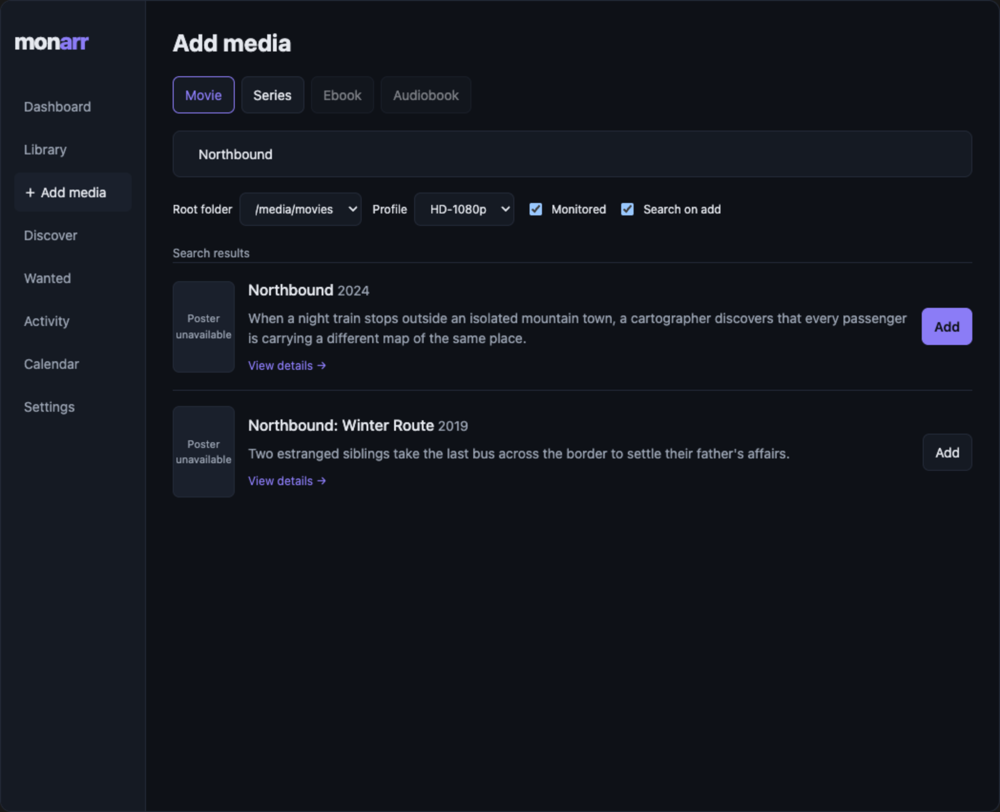
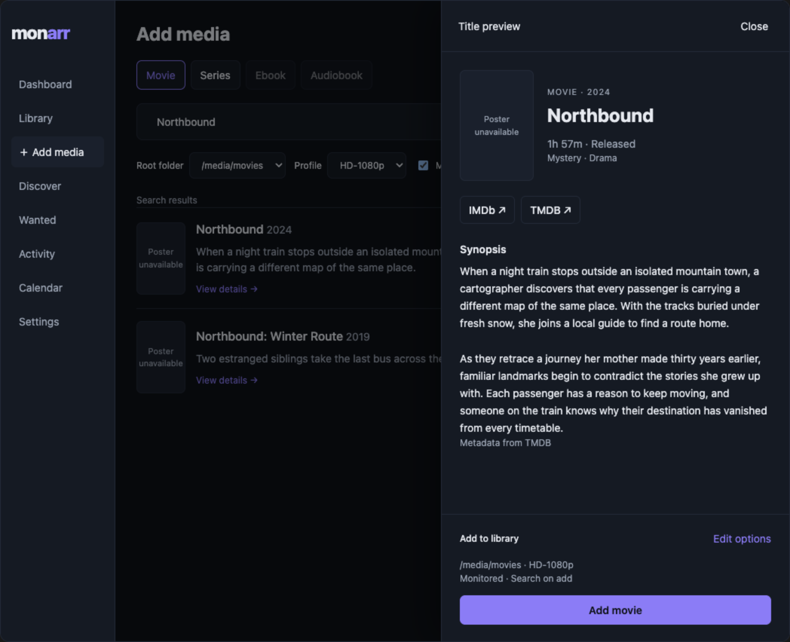
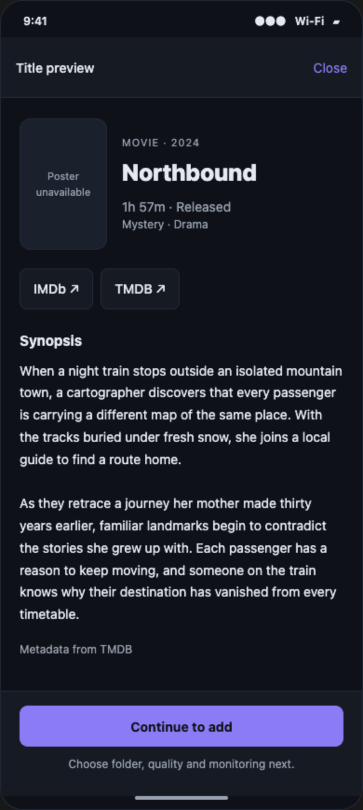

# Search result preview — inspect a title before adding it

**Status:** implemented in v0.26.0 · adversarial review findings addressed · fast lane pending
**Written / revised:** 2026-09-19 · **Code baseline:** `6e17670`

Companion to [usage.md](usage.md) and the
[series identity decision](adr/0011-series-metadata-provider.md): this proposal adds
read-only previews to the add-media search flow on web and mobile. No
application behavior has been changed. Read §1–§4 for the product decision,
then §5–§7 for the implementation contract and acceptance checks. §8 records
the disposition of [Fable’s review](plan-search-result-preview-review.md).
Changes to acquisition or provider identity belong in a separate proposal.
Build from updated `main`, not this older, dirty checkout; §5.1 records the
exact revision inspected. This revision changes documentation and mockups only.

## 1. Outcome — choose the right title without losing your search

Click or tap a result's poster, title, or synopsis area to open its preview.
Read the full synopsis, inspect identifying metadata, and follow available
IMDb, TMDB, or TVDB links. Close the preview to return to the same search,
scroll position, media type, and add options.

**Reviewed direction:** a modal side drawer on desktop web; a full-screen
preview on narrow web and phones. The native app uses one modal presentation
with preview and add-options steps. Keep a separate Add button on results
so people who already recognize a title retain their existing shortcut.

**Opening a preview never adds, monitors, searches for, or downloads media.**
Only the existing final Add action can change the library.

## 2. Renderings — review the interaction before the styling

The screenshots use Monarr's Classic palette and existing UI proportions.
The title, synopsis, year, runtime, and genre values are illustrative data,
not provider responses. Poster fallbacks deliberately show the layout without
artwork. Live provider posters use the same reserved space.

**How to read them:** “View details” opens the preview; Add remains a separate
action. Links sit beside identifying metadata, above the full synopsis. The
footer keeps the next action visible. Real implementations scroll long
content inside the preview; these review images expand vertically to show
all content. They are proposed UI renderings, not application screenshots.

### 2.1 Desktop web — result list and preview drawer





### 2.2 Native mobile — preview before the existing add options



Additional states: [mobile results](renderings/media-preview/mobile-results.png)
· [add options](renderings/media-preview/mobile-add-options.png)
· [narrow web](renderings/media-preview/mobile-web-preview.png)
· [series with TVDB link](renderings/media-preview/web-series-preview.png).

The [web interactive rendering](renderings/media-preview/web.html) and
[mobile interactive rendering](renderings/media-preview/mobile.html) are now
included in the repository. Open either HTML file locally to exercise
selection, close, add, and back. Their readable sources are
[web.fragment.html](renderings/media-preview/web.fragment.html) and
[mobile.fragment.html](renderings/media-preview/mobile.fragment.html).
Add and external links are local simulations; the simplified controls are
not connected to Monarr. These files do not implement router history,
native system Back, or the production metadata API.

Further review fixtures: [already owned](renderings/media-preview/web-owned.png)
· [provider conflict](renderings/media-preview/web-conflict.png)
· [ambiguous local match](renderings/media-preview/web-ambiguous.png)
· [preview only](renderings/media-preview/mobile-unsupported.png)
· [provider unavailable](renderings/media-preview/mobile-error.png)
· [long synopsis and larger reading text](renderings/media-preview/mobile-long-text.png).
All fixtures also show the no-artwork fallback. Larger reading text is a
layout illustration, not proof of native Dynamic Type or screen-reader support.

The linked options image starts from preview, so its back control reads
“‹ Details”. The [direct-Add variant](renderings/media-preview/mobile-direct-add.png)
reads “‹ Results”. The preview itself has only Close; duplicate dismissal
controls have been removed.

## 3. Interaction contract — inspect and add are separate actions

| Surface | Select result | Primary action in preview | Close / back |
|---|---|---|---|
| Desktop web, width ≥ 768 CSS px | Open a right-hand modal drawer, approximately 460 px wide | Add movie / Add series, using the existing page options | Close, Escape, or backdrop restores the initiating result |
| Narrow web, width < 768 CSS px | Open the same component full width and height | Same action and options as desktop web | Close or browser Back returns to results |
| Native mobile | Open a full-height preview using the app's modal infrastructure | Continue to add opens the existing options as the next step in the same modal | Close, system Back, or supported dismissal returns to results |

The proposed 768 px breakpoint is a starting value, to validate at tablet
sizes. Do not make a half-height sheet the default: a synopsis needs reading
space, and a second expansion gesture would obscure the requested feature.

### 3.1 Discoverability and navigation

- Use one semantic “View details →” button with an accessible name such as
  “View details for Northbound, 2024”. On web, keep the poster, title, and
  synopsis outside the button. Make the row positioned and stretch the
  button’s `::after` hit area across it; position Add above that overlay.
  This keeps block content out of the button and makes the row selectable.
  Keep a visible focus indicator. Native uses an equivalent labeled preview
  press target with Add as a separate sibling.
- Render Add as a sibling control, never a button nested inside the preview
  trigger. Its event must not open the preview or cause a second action.
- Preserve result state while a preview is open. Closing does not rerun a
  search unnecessarily, clear its query, reset filters, or scroll to the top.
- On web, move focus into the modal, contain it there, make the background
  inert, support Escape, and restore focus on close. Browser Back closes the
  preview before navigating away. Extend the existing `kind`/`q` route
  search params with `preview=<kind>:<provider>:<id>` and push on open.
  Close pops the entry created by this page; for a URL loaded with `preview`
  already present, remove just that param with replace so Close does not
  leave the app. Back/Forward derive selection from the route. On reload,
  validate the key and restore the preview and search; this is not a broader
  cross-server share-link feature. Use route validation, not a second custom
  history subscription.
- On native mobile, dismiss the keyboard on entry. Android Back goes from
  options to preview, then to results. Direct Add from a result skips preview,
  so Back from its options goes directly to results. Returning from the
  external browser preserves the selected title and its state.
- Use at least 44 × 44 pt native touch targets, equivalent CSS touch targets,
  safe-area padding, readable font scaling, and a scroll region that never
  hides its final lines behind the fixed action footer.

### 3.2 Preview content, in reading order

1. **Identity:** poster, title, year, movie/series label, and author for books.
   Year and media kind distinguish similarly named works before reading.
2. **Optional facts:** runtime, genres, and release/series status when known.
   Omit absent values; never render `0 min`, a made-up status, or empty chips.
   Label series runtime “N min per episode”. Display provider status strings
   as supplied for this release: “Running”, “Returning Series”, “Ended”, etc.
   The provenance label explains their source; do not invent a status mapping.
3. **External links:** labeled IMDb, TMDB, TVDB, or Open Library links,
   exclusively for known IDs. A link to TVDB does not mean TVDB supplied the
   synopsis; metadata provenance appears separately below it.
4. **Synopsis:** all text supplied by the provider, with paragraph breaks.
   No line clamp, hidden tail, second “Read more” step, or hover-only content.
   Preserve plain-text newlines in both clients. Update TVmaze’s `plainText`
   helper to replace paragraph boundaries with `\n\n` and `<br>` variants
   with a newline before stripping remaining tags and decoding entities.
   Add a fixture for adjacent paragraphs, inline tags, and `<br/>`; no HTML
   reaches a markup renderer.
5. **Action footer:** current add context and the appropriate next action.

The full provider synopsis can still be short or missing. Show “No synopsis
available” when neither the result nor detail lookup provides one. Do not
promise plot text a source does not supply.

### 3.3 Preserve each platform's add behavior

**Web:** the drawer reads and edits the same root folder, profile, monitored,
season-monitor preset, and search-on-add state as the page. “Edit options”
expands the existing controls inside the drawer; do not create a second copy
of their state. Add uses the existing mutation and validation. Success stays
in the preview, marks the result Added, and offers Open in library. The page's
added-items strip and library/wanted cache invalidations remain intact.

**Native:** Continue to add presents the existing add configuration. Returning
to the preview and then to options retains those choices for that title.
Keep one `Modal` and the AddSheet state owner mounted for that selected
result; switch the visible child view rather than mounting a second Modal
or unmounting the state owner. Refactor AddSheet’s modal wrapper if needed.
Its roots/profiles fetch and option state survive step changes; reset only
when starting a new selection. `onRequestClose` is step-aware: options →
preview → dismiss, or direct-Add options → dismiss.
Final Add retains the native app's existing behavior of opening the new
library item's detail screen. Direct Add on a result still opens options.
Changing post-add navigation is outside this proposal.

**Defaults:** web currently enables search-on-add by default; mobile defaults
search-now to off. This feature does not silently reconcile those policies.

## 4. States — partial metadata must not block browsing

| State | Expected behavior |
|---|---|
| Opening / enriching | Immediately render the selected result's title, poster, year, full available synopsis, and links derivable from its IDs; indicate only additional details are loading |
| Provider unavailable | Keep result content and known links; show a small “More details couldn’t load” message with Retry; allow Add if its existing prerequisites are satisfied |
| Missing external ID | Omit that link; never search by title behind an IMDb or TVDB label |
| No artwork | Keep a stable poster fallback without shifting the text |
| No matching root folder | Reading and links work; final Add explains the missing folder and stays disabled |
| Already in library | Preview remains accessible; suppress duplicate Add; show In library and Open when fresh ownership lookup returns one unambiguous `libraryItemId` |
| Provider identity conflict (`identity_conflict`, 409) | Keep original search text; discard conflicting enrichment and links from disputed IDs; block Add with the reason |
| Ambiguous local ownership | Render verified provider facts; return ambiguity in the preview DTO, omit `libraryItemId`, and block Add/Open; no links derived from conflicting local IDs |
| Previewable, not addable (`unsupported_hydration`) | Keep readable metadata and verified links; disable Add with the reason; do not hide the record just because it cannot hydrate |
| Adding | Show Adding…, disable duplicate submission, retain the selected identity |
| Add failed | Keep preview and options; show the existing error and allow retry |
| Added elsewhere while preview is open | On `already_exists` 409, recheck preview ownership; show Open only after an unambiguous local ID is resolved. An unresolved or ambiguous lookup never guesses an ID |
| Selection changed / preview closed during lookup | Ignore stale responses; never replace the newly selected title with old metadata |

Books retain separate ebook/audiobook ownership. Their preview uses the same
reading interaction and an Open Library link when the work ID is known.
The screenshots focus on the requested movie/show flow; they do not propose
removing book support or changing its add semantics.

## 5. Contract — immediate result data plus a lightweight lookup

### 5.1 Existing seams, re-verified at `6e17670`

The original proposal inspected local HEAD `0da1c75`. The local
`origin/main` ref points at `6e17670`, which already includes PR #27’s
release-identity changes. This revision was checked with `git show 6e17670:…`,
not by treating the older working tree as current. No fetch or checkout was
performed; `6e17670` is the last locally available main snapshot, not a claim
about GitHub’s latest state. Before building, fetch/re-verify updated main
and use an isolated implementation checkout so unrelated edits are preserved.

Source links below open the working tree; the quoted contracts describe
`6e17670` until that tree is updated.

| File | Relevant behavior at `6e17670` |
|---|---|
| [web AddMedia](../web/src/pages/AddMedia.tsx) | Synopsis is clamped; result key includes TMDB/TVDB/IMDb IDs; Add forwards the original IDs and `hydrationSource` |
| [native SearchCard](../mobile/src/components/Media.tsx) | `numberOfLines` truncates synopsis; Add callback exists, preview callback does not |
| [native DiscoverScreen](../mobile/src/screens/DiscoverScreen.tsx) | AddSheet owns option state and its Modal; search/browse share SearchCard; successful Add calls `onAdded(id)` |
| [web types](../web/src/api.ts) and [native types](../mobile/src/types.ts) | SearchResult already has `imdbId?`, `source?`, and `hydrationSource?`; no genres/status/runtime or local library ID |
| [search handler](../internal/api/library_handlers.go) | Returns full overview and ownership by the result’s ID namespace; no dedicated `/metadata/preview` endpoint |
| [library service](../internal/app/library/library.go) | Search recognizes exact-ID input; `ResolveExternal` does local lookup, rejects ambiguity, and filters unsupported Add hydration |
| [metadata ports](../internal/ports/metadata.go) | `ExternalLookupProvider.LookupExternal` already supplies exact-ID lookup without title search |
| [TMDB adapter](../internal/adapters/tmdb/client.go) | Lookup uses `GetMovie` or lightweight `getSeriesRecord`, with returned-ID checks; full `GetSeries` is unsuitable for preview because it loads seasons |
| [TVmaze adapter](../internal/adapters/tvmaze/client.go) | Search already includes IMDb IDs; exact lookup uses the show endpoint without episodes, validates IDs, and rejects missing TVDB hydration keys |
| [library detail](../web/src/pages/MediaDetail.tsx) | Constructs known-ID external links; reuse its formatting conventions |

Existing exact-ID seam, copied from the metadata port:

```go
type ExternalLookupProvider interface {
    LookupExternal(ctx context.Context, kind domain.MediaKind, ref domain.ExternalRef) ([]SearchResult, error)
}
```

The existing search API already accepts these forms:

```http
GET /api/v1/metadata/search?kind=movie&query=tmdb:550
GET /api/v1/metadata/search?kind=series&query=tvdb:414217
GET /api/v1/metadata/search?kind=series&query=imdb:tt16867040
```

`Search → identityinput.ParseInput → ResolveExternal` handles them. Reuse
its exact-ID provider machinery and conflict checks, but not the entire
resolver: preview must survive local ambiguity and display records that
cannot be added. Most provider lookup work is already built. The remaining
work is retaining optional facts, a preview DTO/endpoint, ownership lookup,
and the two clients’ interaction.

### 5.2 Dedicated preview API; immutable Add input

**Decision:** retain a dedicated authenticated endpoint in
[OpenAPI](../internal/api/openapi.yaml). Preview has a different response
and eligibility policy from search; widening search would couple reading
metadata to Add’s `addable()` filter and ambiguity errors.

```http
GET /api/v1/metadata/preview?kind=movie&tmdbId=550
GET /api/v1/metadata/preview?kind=series&tvdbId=414217
GET /api/v1/metadata/preview?kind=book&olid=OL123W
```

The work ID is illustrative. Accept one canonical lookup key: movie → TMDB;
series → TMDB when the original result has it, otherwise TVDB; book → work
OLID. Include `kind` because TMDB movie and series IDs occupy separate
namespaces. IMDb links use known IDs, but an IMDb-only preview query is not
needed for the existing search results. Do not invent a title-search fallback.

Proposed response, not an implemented type:

```ts
interface MetadataPreview {
  kind: MediaKind
  title: string
  year?: number
  author?: string
  overview: string
  posterPath?: string
  previewSource?: string
  ids: { tmdb?: number; tvdb?: number; imdb?: string; olid?: string }
  genres?: string[]
  status?: string
  runtimeMinutes?: number
  ownership: 'absent' | 'present' | 'ambiguous' | 'unknown'
  libraryItemId?: number
  bookTypes?: BookType[]
  addability: 'supported' | 'unsupported' | 'conflict'
  addBlockReason?: string
}
```

`overview` is plain text; empty means unavailable. Omit unknown facts.
`previewSource` means who supplied these preview facts. It is distinct from
SearchResult’s `source` (mapping discovery) and `hydrationSource` (the
provider Add persists). Preview must never overwrite either of those fields.
`addability` describes metadata/identity eligibility; it does not override
ownership, folder compatibility, or other existing Add validation.

**Identity invariant:** keep the original SearchResult unchanged. Capture
its original `resultKey` when opening and store MetadataPreview separately
under that key. The display can choose enriched facts and links, falling
back to search content; an empty enriched synopsis never erases a nonempty
search synopsis. Do not merge preview IDs or provider fields into the result,
mutate cached search rows, or recompute row keys from preview data.

Web always calls `add.mutate(originalResult)`. Native always passes that same
original result to AddSheet. Ownership/pending/added display state is a
separate overlay keyed by the original result key and selected book edition.
Changing selection invalidates the previous response’s right to update it.

**Required regression:** select an ordinary TMDB series title-search result
with no TVDB ID, then enrich it with TVDB/IMDb IDs. Drawer Add must send the
same identity fields as direct Add, with no new `tvdbId` or `imdbId`; the
original row must show Adding… and then Added / Open. Native gets the same
test. Exact-ID search results may already contain multiple known IDs; preserve
those as received. This feature neither normalizes Add inputs nor adds new
validation to the existing Add contract.

**Ownership:** use the existing `FindMediaItemsByExternalID` database lookup
used by ResolveExternal, without its ambiguity-as-error policy. Check the
requested key and all provider-verified IDs, with kind scoping; deduplicate
matches by local item ID. One consistent local item yields `present` and
`libraryItemId`; no matches yields `absent`; multiple candidates or conflicting
local identity yields `ambiguous`, no libraryItemId, and Add blocked. Lookup
failure yields `unknown`, never a false “not owned”. Never merge local IDs
from contradictory records into the external link set.

This detects a TVDB-keyed library series reached from a TMDB search result
once enrichment exposes its verified TVDB ID. For books, use the existing OLID/work lookup rather than passing `olid` to
`FindMediaItemsByExternalID`, whose switch supports video IDs. Return
`bookTypes` and evaluate ownership per selected edition. A unique existing ebook does not
block adding the missing audiobook.

Do ownership checks fresh per preview request, even when metadata is cached,
and revalidate on reopening, returning from the external browser, or Add’s
`already_exists` response. Do not extend that error response to include an
item ID in this release; refresh ownership instead. A failure or ambiguity
must not turn into a guessed Open link. When enrichment fails, retain any
already-known ownership, but do not infer cross-provider absence.

**Error contract:** reuse the codes already in `libraryErr`:

| Status / code | Preview behavior |
|---|---|
| 400 `invalid_external_id` | Invalid key, kind/key combination, or nonpositive numeric ID; show error and block Add from that invalid preview |
| 503 `provider_unavailable` | Keep result content/known links and existing valid Add path; allow Retry |
| 409 `identity_conflict` | Remote returned IDs conflict with the request; discard those facts/links and block Add |
| 422 `unsupported_hydration` | Retain any known read-only content and links; disable Add with the reason |
| 409 `already_exists` | Add outcome; refresh preview ownership before offering Open |
| 404, existing not-found response | Keep the original result, explain unavailable details, and let existing Add validation remain authoritative |

A successful readable preview uses 200 even when `addability` is unsupported
or local ownership is ambiguous; those conditions are represented in the DTO.
A 422 is the fallback when a service/adapter cannot supply a readable preview.
Do not run successful preview data through ResolveExternal’s Add eligibility
filter. Existing search coverage stays unchanged: the unsupported fixture is
defensive handling, not a promise to surface previously filtered TVmaze shows.

### 5.3 Extend the existing exact-ID lookups to retain facts

Prefer a small preview capability that shares record-fetching/parsing helpers
with `LookupExternal`; do not duplicate external lookup, ID validation,
provider routing, or fallback logic. Keep search and Add’s existing contracts
stable. The interface shape is an implementation choice after re-verifying
main, not a demand for a second lookup pipeline.

- TMDB movies reuse `GetMovie`. Series reuse `getSeriesRecord` and extend its
  mapping to retain `Status`, `Genres`, and nonempty `EpisodeRunTime`; no
  season-detail requests.
- TVmaze reuses the validated `/lookup/shows` record and retains `Status`,
  `Genres`, and positive `AverageRuntime`; no episode requests. Split record
  reading from Add eligibility so unsupported hydration need not erase facts.
- Books reuse the existing work-level `BookProvider.GetBook` lookup.
- Preserve `RemoteIdentityConflict` checks. A preview must not accept a
  returned identity the existing exact-ID adapter would reject.

Fetch only after selection. Cancel or ignore superseded work. Cache metadata
by server connection + kind + canonical provider ID, with a proposed client
stale time of five minutes. Cache metadata separately from ownership.
**Both TMDB and TVmaze already have URL-keyed, five-minute response caches at
`6e17670`.** TVmaze’s `Client.cache`, `ttl`, and `get` prove this; review S8’s
claim that only TMDB caches is incorrect for that revision. Reuse both caches.

Build links from validated IDs using the existing web detail-page patterns.
Centralize formatting within each client and share test cases for namespace
and absent-ID behavior. Web links use HTTPS, a labeled external indicator,
and a new tab with `noopener noreferrer`; native uses the system link handler
and reports an opening failure inline. Never render provider HTML as markup.

## 6. Scope and decisions — keep this a preview feature

1. **Drawer on desktop, full screen on phones.** This keeps the search context
   visible on desktop and gives long descriptions usable width on phones.
   Fable endorsed the drawer; the centered-dialog alternative is retired.
2. **Preserve direct Add.** Preview is optional, so batch additions gain no
   mandatory extra click. Touch and keyboard get explicit independent actions.
3. **Read immediately, enrich on selection.** Search remains fast and a slow
   provider does not withhold synopsis text already in memory.
4. **Known identity only.** Provider IDs can describe different groupings of
   a show; a guessed cross-provider title match could link to the wrong work.
5. **Reuse add policy.** Separate preview components may share a data contract,
   but folder compatibility, quality defaults, and monitoring remain owned by
   the existing add flow.

**Non-goals:** trailers, cast biographies, recommendations, ratings aggregation,
a new metadata provider, series/episode browsing, library schema migrations,
provider rematching, and a redesign of all Discover cards. Each adds data or
behavior unrelated to inspecting a search result. Native browse cards gain the
same preview because they already share SearchCard; broader web Discover
integration can follow separately.

## 7. Implementation milestones and acceptance checks

### 7.1 Metadata preview contract

From updated main, add the API schema, generated bindings, preview DTO,
fact-preserving extensions to existing exact-ID helpers, and fresh ownership
lookup. Add focused tests for TMDB movies/series, TVDB-keyed series, books,
missing fields, structured errors, remote conflict, unsupported hydration,
local ambiguity, cross-provider ownership, and TVmaze paragraph conversion.

**Acceptance:** previewing a series produces no season-detail or episode
requests, no library rows, no acquisition jobs, and no filesystem writes.
IDs in the response belong to the requested identity. A TMDB result for an
existing TVDB-keyed item resolves to one real library ID; ambiguous matches
return readable preview data with Add/Open blocked.

### 7.2 Web preview

Add the accessible drawer/full-screen component, result trigger, lazy query,
external links, and shared add controls. Keep selection distinct from pending
Add state. Cover Escape/Back, focus restoration, duplicate Add prevention,
result-to-result races, partial lookup failure, route reload/Back/Forward,
and unchanged search options. Pin the original-result identity invariant
from §5.2 with an Add request-body and result-row state regression test.

**Acceptance:** at desktop and 320 CSS px widths, every synopsis line is
reachable and the footer does not cover it. Opening and closing preserves
query, results, scroll, and options. Direct Add still takes one click.

### 7.3 Native preview

Add the preview callback to SearchCard and a single preview/options modal
flow in DiscoverScreen. Reuse the existing options and final add function;
keep its state owner mounted while switching child views. Test changing the
profile and monitoring options, returning to preview, and reopening options
without losing those choices or changing the original result. Add contract/state tests
and perform device or simulator checks for the actual native behavior.

**Acceptance:** verify iOS dismissal, Android Back, large text, keyboard
entry, external-browser return, no double submission, and the existing
post-add library navigation. The narrow web layout is tested separately;
its success does not establish native correctness.

### 7.4 Delivery checks

The 2026-09-19 delivery instruction supersedes the original full-gate plan:
use an independent clone, batch focused commits into one PR, obtain an
adversarial review once ready to merge, fix its findings, then run the fast
lane below. Full unit-suite triage belongs to the separate batch process.

```bash
# After adversarial review fixes, from the independent clone.
make lint
npm --prefix web run build
npm --prefix mobile run typecheck
go test ./internal/app/library ./internal/api ./internal/adapters/tmdb ./internal/adapters/tvmaze -run 'TestPreview' -count=1
npm --prefix web test -- src/metadataPreview.test.ts
npm --prefix mobile test -- src/metadataPreview.test.ts src/screens/DiscoverScreen.test.tsx
make go-build
cd test/e2e && npx playwright test tests/search-preview.spec.ts --project=desktop
```

Regenerate the API with `make gen-api` and verify no generated drift.
Native component tests cover step retention, original Add IDs, stale
responses, and duplicate submission. Physical iOS/Android dismissal,
external-browser return, and large-font behavior require device validation;
web viewport checks do not establish those native results.

**Proposal verification, 2026-09-19: passed.** The repository now includes a repeatable
[rendering verifier](renderings/media-preview/verify.cjs). It opens the included
standalone HTML, checks selection/close/add/back and option retention, exercises
ownership and error states, checks desktop/narrow bounds, and regenerates PNGs.
It uses the repository’s Playwright dependency and an installed browser:

```bash
# From the repository root; use installed Chrome on this Mac.
PLAYWRIGHT_CHANNEL=chrome node docs/renderings/media-preview/verify.cjs
```

Omit the variable when Playwright’s bundled Chromium is installed. No live
Monarr server, external provider, private temporary file, or Codex skill file
is needed. These are mockup checks, not application tests. The application
gate was not run for these documentation/mockup edits. Real native-device
accessibility checks remain implementation work.

## 8. Fable review — disposition of the requested changes

[Fable’s original review](plan-search-result-preview-review.md) remains intact.
Its product decisions are accepted: desktop drawer, full-screen phones,
separate direct Add, immediate result content, lazy enrichment, known identity
only, and links above the synopsis. This revision addresses the build blockers;
it does not claim Fable has re-reviewed it or authorize implementation.

| Review item | Disposition in this revision |
|---|---|
| M1: stale baseline / duplicate lookup work | §5.1 names `6e17670`; §5.3 extends existing exact-ID helpers; build starts from updated main |
| M2: enrichment changes Add identity / keys | §5.2 separates original result and preview; both clients’ Add inputs stay unchanged; explicit regression |
| S1: lost paragraphs | §3.2 includes TVmaze plain-text boundary conversion and a fixture |
| S2: codes / conflict / unsupported states | §4 and §5.2 specify codes and readable-but-blocked outcomes |
| S3: local ownership / Open | §5.2 resolves all verified IDs, returns unambiguous libraryItemId, and refreshes after `already_exists` |
| S4: native state retention | §3.3 and §7.3 keep one modal and a mounted option-state owner |
| S5: semantic web trigger | §3.1 and the web mock use a text button with a stretched row hit area, Add above it |
| S6: browser history | §3.1 defines the preview search param and push/close/reload behavior |
| S7: gate / inspectable mockups | §7.4 includes test-mobile; §2 links repo-owned HTML, sources, fixtures, and verifier |
| S8: caching | Source check corrects the review: both adapters cache for five minutes at `6e17670` |
| Visual / naming nits | Series root paths agree, mobile preview has only Close, direct-Add options are rendered, series runtime says per episode, provider status remains raw, preview provenance is named separately |

The [README](../README.md) now includes this proposal in its documentation
reading path. Before building, recheck the baseline and review this revised
contract alongside the original comments. No application behavior is changed
by this revision.

## 9. Implementation review — 2026-09-19

The final adversarial agent review requested four corrections before the first
fast-lane run. All four are addressed in the implementation:

| Finding | Correction and focused coverage |
|---|---|
| Native 409 followed by 503 cleared a conflict | Conflict remains latched until verified success or a new selection; native component regression covers the retry sequence. |
| URL restoration depended on search supporting OLIDs and returning addable unambiguous records | Cold URLs retain only their validated route identity and use the preview endpoint directly. Book reload and ambiguous TVDB restoration have browser regressions. In-memory selections retain their original search payload. |
| Coded 422 left Add enabled | Both clients preserve the unsupported reason and Add block across unsuccessful retries; native and browser cases cover recovery. |
| Native fixed footer omitted the bottom inset | Footer padding includes the safe-area bottom inset; native component coverage supplies a nonzero inset. |

No tests ran before this review. The status page records the subsequent fast
lane and merge outcome. No feature flag or additional enablement setting is
needed for this always-available read-only view.
